# Portfolio & CMS Backend — Engineering Specifications & Architecture Guide

[](https://www.oracle.com/java/)
[](https://spring.io/projects/spring-boot)
[](https://spring.io/projects/spring-security)
[-blue.svg)](https://aiven.io/postgresql)
[](https://azure.microsoft.com/en-us/products/app-service/)
[](https://github.com/features/actions)

---

## 1. System Overview

This document provides the definitive, production-grade technical architecture and API specifications for the **Mohi Ud Din Portfolio & Content Management System (CMS)** backend. The service delivers a secure, high-performance RESTful API powering both the public portfolio interface and the authenticated admin dashboard.

### Core Deployments

| Component | Platform / Host | Production Endpoint |
| :--- | :--- | :--- |
| **Backend REST API** | Azure App Service (Linux / Java 21) | `https://mohiuddingportfolio-backend-a7bvekdghfg2a3fg.centralindia-01.azurewebsites.net` |
| **Health Check** | Azure App Service | `https://mohiuddingportfolio-backend-a7bvekdghfg2a3fg.centralindia-01.azurewebsites.net/api/health` |
| **Database** | Aiven Cloud PostgreSQL | Managed PostgreSQL Cluster |
| **Frontend Client** | Vercel (Edge CDN) | `https://www.mohiuddin.tech` |

---

## 2. High-Level Architecture & Request Flow

The backend adheres to standard **3-Tier Layered Architecture** with strict separation of concerns, stateless authentication, and enterprise design patterns.

```
                               ┌─────────────────────────────────────────┐
                               │   Client Layer (React / Vite Frontend)   │
                               │        https://www.mohiuddin.tech       │
                               └────────────────────┬────────────────────┘
                                                    │ HTTPS / JSON
                                                    ▼
┌─────────────────────────────────────────────────────────────────────────────────────────────────┐
│ Spring Boot Backend (Azure App Service)                                                         │
│                                                                                                 │
│  ┌───────────────────────────────────────────────────────────────────────────────────────────┐  │
│  │ Security Filter Chain                                                                     │  │
│  │   - CorsConfig / CorsFilter (Allowed Origins)                                             │  │
│  │   - JwtAuthenticationFilter (Header Extraction & Token Validation)                        │  │
│  │   - SecurityFilterChain (RBAC URL Rules & Access Control)                                 │  │
│  └─────────────────────────────────────────┬─────────────────────────────────────────────────┘  │
│                                            │ Validated Request                                  │
│                                            ▼                                                    │
│  ┌───────────────────────────────────────────────────────────────────────────────────────────┐  │
│  │ Controller Layer (@RestController)                                                        │  │
│  │   - Auth, Profile, Projects, Skills, Experience, Education, Contact, Media, Settings     │  │
│  │   - DTO Validation (@Valid, Jakarta Validation Constraints)                               │  │
│  │   - GlobalExceptionHandler (@RestControllerAdvice)                                        │  │
│  └─────────────────────────────────────────┬─────────────────────────────────────────────────┘  │
│                                            │ Clean DTOs                                         │
│                                            ▼                                                    │
│  ┌───────────────────────────────────────────────────────────────────────────────────────────┐  │
│  │ Service Layer (@Service)                                                                  │  │
│  │   - Transaction Management (@Transactional)                                               │  │
│  │   - Business Logic, Entity Mappings, Password Hashing (BCrypt)                            │  │
│  │   - BLOB Media Processing & Cache-Busting Resolution                                      │  │
│  └─────────────────────────────────────────┬─────────────────────────────────────────────────┘  │
│                                            │ Entities                                           │
│                                            ▼                                                    │
│  ┌───────────────────────────────────────────────────────────────────────────────────────────┐  │
│  │ Repository Layer (Spring Data JPA)                                                        │  │
│  │   - JpaRepository Interfaces & Derived Queries                                            │  │
│  │   - Hibernate ORM / Connection Pooling via HikariCP                                       │  │
│  └─────────────────────────────────────────┬─────────────────────────────────────────────────┘  │
└────────────────────────────────────────────┼────────────────────────────────────────────────────┘
                                             │ SQL over TLS
                                             ▼
                               ┌─────────────────────────────────────────┐
                               │     Managed PostgreSQL (Aiven Cloud)    │
                               │        Tables & Relations Persistence   │
                               └─────────────────────────────────────────┘
```

---

## 3. Project Structure

Root Package: `com.mohiudding.portfolio_Backend`

```
portfolio-Backend/
├── .mvn/
│   └── wrapper/
├── src/
│   ├── main/
│   │   ├── java/com/mohiudding/portfolio_Backend/
│   │   │   ├── PortfolioBackendApplication.java    # Application entrypoint & .env loader
│   │   │   │
│   │   │   ├── config/                             # Spring & Web security configuration
│   │   │   │   ├── CorsConfig.java                 # WebMvc CORS registry
│   │   │   │   ├── DataInitializer.java            # Database seeder (Admin & default data)
│   │   │   │   ├── SecurityConfig.java             # Spring Security 6 filter chain & RBAC
│   │   │   │   └── WebMvcConfig.java               # Static resource routing
│   │   │   │
│   │   │   ├── controller/                         # REST API Controllers
│   │   │   │   ├── AuthController.java             # /api/auth
│   │   │   │   ├── ContactController.java          # /api/contact
│   │   │   │   ├── EducationController.java        # /api/education
│   │   │   │   ├── ExperienceController.java       # /api/experience
│   │   │   │   ├── FileUploadController.java       # /api/upload
│   │   │   │   ├── HealthController.java           # / & /api/health
│   │   │   │   ├── MediaController.java            # /api/media
│   │   │   │   ├── ProfileController.java          # /api/portfolio
│   │   │   │   ├── ProjectController.java          # /api/projects
│   │   │   │   ├── ResumeController.java           # /api/resume
│   │   │   │   ├── SettingsController.java         # /api/settings
│   │   │   │   ├── SkillController.java            # /api/skills
│   │   │   │   ├── TranslationController.java      # /api/translations
│   │   │   │   └── UserController.java             # /api/users
│   │   │   │
│   │   │   ├── dto/                                # Data Transfer Objects
│   │   │   │   ├── ApiResponse.java                # Standard response wrapper
│   │   │   │   ├── ContactRequest.java             # Contact submission payload
│   │   │   │   ├── EducationDto.java               # Education payload
│   │   │   │   ├── ErrorResponse.java              # Standard error envelope
│   │   │   │   ├── ExperienceDto.java              # Experience payload
│   │   │   │   ├── LoginRequest.java               # Admin login credentials
│   │   │   │   ├── LoginResponse.java              # JWT authentication token
│   │   │   │   ├── PasswordChangeRequest.java      # Credential rotation
│   │   │   │   ├── ProfileDto.java                 # Profile entity payload
│   │   │   │   ├── ProfileStatDto.java             # Highlight metric stats
│   │   │   │   ├── ProjectDto.java                 # Showcase project payload
│   │   │   │   ├── SeoMetadataDto.java             # Global SEO payload
│   │   │   │   ├── SiteSettingsDto.java            # Site-wide settings payload
│   │   │   │   ├── SkillDto.java                   # Technical skill payload
│   │   │   │   ├── SocialLinksDto.java             # Social media URLs
│   │   │   │   ├── TranslationEntryDto.java        # I18n translation pair
│   │   │   │   └── UpdateProfileRequest.java       # Admin account update payload
│   │   │   │
│   │   │   ├── exception/                          # Exception hierarchy & handlers
│   │   │   │   ├── BadRequestException.java        # 400 Bad Request exception
│   │   │   │   ├── GlobalExceptionHandler.java     # @RestControllerAdvice handler
│   │   │   │   └── ResourceNotFoundException.java  # 404 Not Found exception
│   │   │   │
│   │   │   ├── model/                              # JPA Entities
│   │   │   │   ├── ContactMessage.java             # Inbound visitor inquiries
│   │   │   │   ├── Education.java                  # Academic qualifications
│   │   │   │   ├── Experience.java                 # Professional work history
│   │   │   │   ├── MediaFile.java                  # Database-stored BLOB media
│   │   │   │   ├── Profile.java                    # Biography & main profile
│   │   │   │   ├── ProfileStat.java                # Highlight statistic numbers
│   │   │   │   ├── Project.java                    # Showcase portfolio projects
│   │   │   │   ├── SeoMetadata.java                # @Embeddable SEO fields
│   │   │   │   ├── SiteSettings.java               # Global configuration
│   │   │   │   ├── Skill.java                      # Technical competencies
│   │   │   │   ├── SocialLinks.java                # @Embeddable social links
│   │   │   │   ├── TranslationEntry.java           # Multi-language dictionary
│   │   │   │   └── User.java                       # Admin authentication entity
│   │   │   │
│   │   │   ├── repository/                         # Spring Data JPA Repositories
│   │   │   │   ├── ContactMessageRepository.java
│   │   │   │   ├── EducationRepository.java
│   │   │   │   ├── ExperienceRepository.java
│   │   │   │   ├── MediaFileRepository.java
│   │   │   │   ├── ProfileRepository.java
│   │   │   │   ├── ProfileStatRepository.java
│   │   │   │   ├── ProjectRepository.java
│   │   │   │   ├── SiteSettingsRepository.java
│   │   │   │   ├── SkillRepository.java
│   │   │   │   ├── TranslationEntryRepository.java
│   │   │   │   └── UserRepository.java
│   │   │   │
│   │   │   ├── security/                           # JWT & Security plumbing
│   │   │   │   ├── CustomAccessDeniedHandler.java  # 403 Forbidden handler
│   │   │   │   ├── JwtAuthenticationEntryPoint.java# 401 Unauthorized handler
│   │   │   │   ├── JwtAuthenticationFilter.java    # Per-request bearer token validator
│   │   │   │   ├── JwtService.java                 # JWT HMAC-SHA256 issuer/parser
│   │   │   │   └── UserDetailsServiceImpl.java     # Spring Security UserDetails loader
│   │   │   │
│   │   │   └── service/                            # Service Interfaces & Implementations
│   │   │       ├── AuthService.java
│   │   │       ├── ContactService.java
│   │   │       ├── EducationService.java
│   │   │       ├── ExperienceService.java
│   │   │       ├── FileStorageService.java
│   │   │       ├── ProfileService.java
│   │   │       ├── ProjectService.java
│   │   │       ├── ResumeService.java
│   │   │       ├── SettingsService.java
│   │   │       ├── SkillService.java
│   │   │       ├── TranslationService.java
│   │   │       ├── UserService.java
│   │   │       └── impl/
│   │   │           ├── AuthServiceImpl.java
│   │   │           ├── ContactServiceImpl.java
│   │   │           ├── EducationServiceImpl.java
│   │   │           ├── ExperienceServiceImpl.java
│   │   │           ├── FileStorageServiceImpl.java
│   │   │           ├── ProfileServiceImpl.java
│   │   │           ├── ProjectServiceImpl.java
│   │   │           ├── ResumeServiceImpl.java
│   │   │           ├── SettingsServiceImpl.java
│   │   │           ├── SkillServiceImpl.java
│   │   │           ├── TranslationServiceImpl.java
│   │   │           └── UserServiceImpl.java
│   │   │
│   │   └── resources/
│   │       └── application.properties              # Core configuration & datasource pool
│   │
│   └── test/
│       └── java/com/mohiudding/portfolio_Backend/
│           ├── PortfolioBackendApplicationTests.java
│           └── security/
│               └── SecurityIntegrationTest.java    # Full security test suite
├── Dockerfile                                      # Multi-stage production container
├── pom.xml                                         # Maven dependency & build definitions
└── mvnw / mvnw.cmd                                 # Maven wrappers
```

---

## 4. Database Schema & Data Models

### Entity Relationship Model

```mermaid
erDiagram
    USERS {
        bigint id PK
        varchar email UK
        varchar password
        varchar name
        varchar role
        timestamp created_at
        timestamp updated_at
    }
    PROFILES ||--o{ PROFILE_STATS : has
    PROFILES {
        bigint id PK
        varchar name
        varchar title
        varchar tagline
        text bio
        varchar avatar_url
        varchar email
        varchar location
        varchar availability
        varchar github_url
        varchar linkedin_url
        varchar resume_url
    }
    PROFILE_STATS {
        bigint id PK
        bigint profile_id FK
        varchar stat_value
        varchar label
    }
    PROJECTS ||--o{ PROJECT_TECHNOLOGIES : contains
    PROJECTS {
        bigint id PK
        varchar title
        text description
        varchar image
        varchar github_url
        varchar live_url
        boolean featured
        varchar date
        timestamp created_at
        timestamp updated_at
    }
    PROJECT_TECHNOLOGIES {
        bigint project_id FK
        varchar technology
    }
    SKILLS {
        bigint id PK
        varchar name
        varchar category
        varchar icon
        varchar level
        int years_of_experience
    }
    EXPERIENCES ||--o{ EXPERIENCE_DESCRIPTIONS : has
    EXPERIENCES ||--o{ EXPERIENCE_TECHNOLOGIES : uses
    EXPERIENCES {
        bigint id PK
        varchar company
        varchar position
        varchar location
        varchar start_date
        varchar end_date
    }
    EDUCATIONS ||--o{ EDUCATION_ACHIEVEMENTS : has
    EDUCATIONS {
        bigint id PK
        varchar degree
        varchar institution
        varchar start_date
        varchar end_date
        text description
    }
    CONTACT_MESSAGES {
        bigint id PK
        varchar name
        varchar email
        varchar subject
        text message
        boolean is_read
        timestamp created_at
    }
    SITE_SETTINGS {
        bigint id PK
        varchar site_title
        text site_description
        varchar contact_email
        varchar resume_url
        varchar github_url
        varchar linkedin_url
        varchar meta_title
        text meta_description
    }
    TRANSLATIONS {
        bigint id PK
        varchar key UK
        text en
        text ur
    }
    MEDIA_FILES {
        bigint id PK
        varchar file_name
        varchar content_type
        varchar file_type
        bigint file_size
        bytea data
        timestamp created_at
        timestamp updated_at
    }
```



---

## 5. RESTful API Reference

### Diagnostics & Health

| Method | Endpoint | Access | Description | Success Response |
| :--- | :--- | :--- | :--- | :--- |
| `GET` | `/` | **Public** | Root service health check | `200 OK` (`{"status":"UP"}`) |
| `GET` | `/api/health` | **Public** | Health endpoint for uptime monitors | `200 OK` (`{"status":"UP", "message":"..."}`) |

---

### Authentication (`/api/auth`)

| Method | Endpoint | Access | Request Body | Response Payload |
| :--- | :--- | :--- | :--- | :--- |
| `POST` | `/api/auth/login` | **Public** | `LoginRequest` (`email`, `password`) | `LoginResponse` (`token`, `user`) |
| `POST` | `/api/auth/logout`| **Auth** | None | `200 OK` (`{"message": "Logged out successfully"}`) |
| `GET` | `/api/auth/me` | **Auth** | None | `UserDto` (`id`, `email`, `name`, `role`) |

---

### Portfolio Profile (`/api/portfolio`)

| Method | Endpoint | Access | Request Body | Response Payload |
| :--- | :--- | :--- | :--- | :--- |
| `GET` | `/api/portfolio` | **Public** | None | `Profile` (with nested `stats`) |
| `PUT` | `/api/portfolio` | **ADMIN** | `ProfileDto` | Updated `Profile` |

---

### Skills Management (`/api/skills`)

| Method | Endpoint | Access | Request Body | Response Payload |
| :--- | :--- | :--- | :--- | :--- |
| `GET` | `/api/skills` | **Public** | None | `List<Skill>` |
| `GET` | `/api/skills/{id}` | **Public** | None | `Skill` |
| `GET` | `/api/skills/category/{category}` | **Public** | None | `List<Skill>` |
| `POST` | `/api/skills` | **ADMIN** | `SkillDto` | `201 Created` (`Skill`) |
| `PUT` | `/api/skills/{id}` | **ADMIN** | `SkillDto` | Updated `Skill` |
| `DELETE` | `/api/skills/{id}` | **ADMIN** | None | `204 No Content` |

---

### Projects Showcase (`/api/projects`)

| Method | Endpoint | Access | Request Body | Response Payload |
| :--- | :--- | :--- | :--- | :--- |
| `GET` | `/api/projects` | **Public** | None | `List<Project>` |
| `GET` | `/api/projects/featured` | **Public** | None | `List<Project>` (Featured only) |
| `GET` | `/api/projects/{id}` | **Public** | None | `Project` |
| `POST` | `/api/projects` | **ADMIN** | `ProjectDto` | `201 Created` (`Project`) |
| `PUT` | `/api/projects/{id}` | **ADMIN** | `ProjectDto` | Updated `Project` |
| `DELETE` | `/api/projects/{id}` | **ADMIN** | None | `204 No Content` |

---

### Experience & Timeline (`/api/experience`)

| Method | Endpoint | Access | Request Body | Response Payload |
| :--- | :--- | :--- | :--- | :--- |
| `GET` | `/api/experience` | **Public** | None | `List<Experience>` |
| `GET` | `/api/experience/{id}` | **Public** | None | `Experience` |
| `POST` | `/api/experience` | **ADMIN** | `ExperienceDto` | `201 Created` (`Experience`) |
| `PUT` | `/api/experience/{id}` | **ADMIN** | `ExperienceDto` | Updated `Experience` |
| `DELETE` | `/api/experience/{id}` | **ADMIN** | None | `204 No Content` |

---

### Education & Credentials (`/api/education`)

| Method | Endpoint | Access | Request Body | Response Payload |
| :--- | :--- | :--- | :--- | :--- |
| `GET` | `/api/education` | **Public** | None | `List<Education>` |
| `GET` | `/api/education/{id}` | **Public** | None | `Education` |
| `POST` | `/api/education` | **ADMIN** | `EducationDto` | `201 Created` (`Education`) |
| `PUT` | `/api/education/{id}` | **ADMIN** | `EducationDto` | Updated `Education` |
| `DELETE` | `/api/education/{id}` | **ADMIN** | None | `204 No Content` |

---

### Contact Messages & Inquiries (`/api/contact`)

| Method | Endpoint | Access | Request Body | Response Payload |
| :--- | :--- | :--- | :--- | :--- |
| `POST` | `/api/contact` | **Public** | `ContactRequest` (`name`, `email`, `subject`, `message`) | `200 OK` (`ApiResponse`) |
| `GET` | `/api/contact/messages` | **ADMIN** | None | `List<ContactMessage>` |
| `PATCH`| `/api/contact/messages/{id}/read` | **ADMIN** | `Map<String, Boolean>` (`{"read": true}`) | Updated `ContactMessage` |
| `DELETE`| `/api/contact/messages/{id}` | **ADMIN** | None | `204 No Content` |

---

### Site Settings & SEO (`/api/settings`)

| Method | Endpoint | Access | Request Body | Response Payload |
| :--- | :--- | :--- | :--- | :--- |
| `GET` | `/api/settings` | **Public** | None | `SiteSettings` |
| `PUT` | `/api/settings` | **ADMIN** | `SiteSettingsDto` | Updated `SiteSettings` |

---

### Localization / I18n (`/api/translations`)

| Method | Endpoint | Access | Request Body | Response Payload |
| :--- | :--- | :--- | :--- | :--- |
| `GET` | `/api/translations` | **Public** | None | `List<TranslationEntry>` |
| `PUT` | `/api/translations` | **ADMIN** | `List<TranslationEntryDto>` | Updated `List<TranslationEntry>` |

---

### Media & Resume Management (`/api/media`, `/api/resume`, `/api/upload`)

| Method | Endpoint | Access | Request Body | Response Payload / Description |
| :--- | :--- | :--- | :--- | :--- |
| `GET` | `/api/media/{id}` | **Public** | None | Direct binary stream with accurate MIME headers |
| `POST` | `/api/media/avatar` | **ADMIN** | `multipart/form-data` (`file`) | `{"url": "/api/media/{id}", "id": 1}` |
| `GET` | `/api/resume` | **Public** | None | `{"url": "/api/resume/download"}` |
| `GET` | `/api/resume/download` | **Public** | None | Streams active PDF resume (`application/pdf`) |
| `POST` | `/api/resume` | **ADMIN** | `multipart/form-data` (`file`) | Replaces PDF in DB & disk (`{"url": "..."}`) |
| `DELETE`| `/api/resume` | **ADMIN** | None | `204 No Content` |
| `POST` | `/api/upload` | **ADMIN** | `multipart/form-data` (`file`, `category`) | Uploads image & returns accessible URL |

---

## 6. Security Architecture

### 1. Stateless JWT Lifecycle
- **Algorithm:** HMAC-SHA256 (`HS256`) with 256-bit cryptographically secure secret key.
- **Expiration:** Default `86,400,000 ms` (24 Hours), configurable via `JWT_EXPIRATION`.
- **Transmission:** Clients include token in the `Authorization` header as `Bearer <token>`.
- **Interception:** `JwtAuthenticationFilter` intercepts inbound HTTP requests, extracts the JWT, verifies the signature, and sets the authenticated `UsernamePasswordAuthenticationToken` in `SecurityContextHolder`.

### 2. Role-Based Access Control (RBAC) Matrix

```
                        ┌───────────────────────────────┐
                        │   Incoming HTTP Request       │
                        └───────────────┬───────────────┘
                                        │
                         Is route in public whitelist?
                                ├─── YES ───► Allow (200 OK)
                                │             - GET /api/portfolio/**
                                │             - GET /api/skills/**
                                │             - GET /api/projects/**
                                │             - GET /api/experience/**
                                │             - GET /api/education/**
                                │             - GET /api/settings/**
                                │             - GET /api/translations/**
                                │             - GET /api/resume/**
                                │             - GET /api/media/**
                                │             - GET /uploads/**
                                │             - GET /, /api/health
                                │             - POST /api/auth/login
                                │             - POST /api/contact
                                │
                                └─── NO ────► Requires JWT with ROLE_ADMIN
                                              - POST, PUT, PATCH, DELETE /api/**
                                              - GET /api/auth/me, /api/auth/logout
                                              - GET /api/contact/messages/**
                                              - /api/upload/**, /api/users/**
```

### 3. Cross-Origin Resource Sharing (CORS)
Configured in both `SecurityConfig` and `CorsConfig` to allow full REST verb compatibility (`GET`, `POST`, `PUT`, `DELETE`, `PATCH`, `OPTIONS`) with support for credentials:
- **Allowed Origins:** `https://www.mohiuddin.tech`, `https://mohiuddin.tech`, `http://localhost:5173`, `http://localhost:3000`
- **Exposed Headers:** `Authorization`, `Content-Disposition`
- **Max Age:** `3600` seconds (1 hour pre-flight cache)

---

## 7. Environment Variables & Configuration

The application supports native `.env` loading at startup as well as standard cloud environment injection (Azure App Service Configuration, Docker, Kubernetes).

| Variable Name | Required | Default / Fallback | Description |
| :--- | :--- | :--- | :--- |
| `PORT` | Optional | `8080` | Port for the embedded Tomcat web server |
| `DB_URL` | **Required** | None | JDBC PostgreSQL connection string |
| `DB_USERNAME` | **Required** | None | Database authentication username |
| `DB_PASSWORD` | **Required** | None | Database authentication password |
| `DB_DRIVER` | Optional | `org.postgresql.Driver` | Database JDBC driver class |
| `DB_DIALECT` | Optional | `org.hibernate.dialect.PostgreSQLDialect` | Hibernate SQL dialect |
| `HIBERNATE_DDL_AUTO` | Optional | `update` | DDL schema management (`validate`, `update`, `none`) |
| `JWT_SECRET` | **Required** | None | Cryptographic secret for signing tokens |
| `JWT_EXPIRATION` | Optional | `86400000` (24h) | Token validity period in milliseconds |
| `ADMIN_EMAIL` | Optional | `admin@mohiuddin.dev` | Initial admin account email seeded on first boot |
| `ADMIN_PASSWORD` | Optional | `admin123` | Initial admin password (hashed on insert) |
| `ADMIN_NAME` | Optional | `Mohi Ud Din` | Initial admin display name |
| `FILE_UPLOAD_DIR` | Optional | `uploads` | Local directory for static media persistence |
| `CORS_ALLOWED_ORIGINS`| Optional | Whitelist of frontend origins | Comma-separated list of permitted origin URLs |

---

## 8. CI/CD & Deployment Pipeline

### 1. Production Build & Deployment (`main_mohiuddingportfolio-backend.yml`)
- Triggers automatically on push to branch `main`.
- **Build Stage:** Sets up Java 21 (Microsoft OpenJDK), builds optimized executable JAR with Maven (`mvn clean package -DskipTests`), and uploads artifact.
- **Deploy Stage:** Deploys target package to **Azure App Service** (`mohiuddingportfolio-backend`) via publish profile secrets.

### 2. Keep-Alive Worker (`keep-alive.yml`)
- Triggers on a scheduled cron (`*/10 * * * *`) every 10 minutes.
- Pings the health endpoint `https://mohiuddingportfolio-backend-a7bvekdghfg2a3fg.centralindia-01.azurewebsites.net/api/health` with retry support.
- Prevents container cold-starts and ensures sub-second response times for visitors and search engine crawlers.

---

## 9. Local Development Guide

### Prerequisites
- **JDK 21** or higher
- **Maven 3.9+** (or use included `./mvnw`)
- **Docker** (Optional, for containerized execution)
- **PostgreSQL 15+** or local H2

### 1. Clone & Configure
Create a `.env` file in `portfolio-Backend/.env`:
```env
PORT=8080
DB_URL=jdbc:postgresql://localhost:5432/portfolio_db
DB_USERNAME=postgres
DB_PASSWORD=your_local_password
JWT_SECRET=your_super_secret_jwt_key_at_least_32_characters_long_12345
ADMIN_EMAIL=admin@mohiuddin.dev
ADMIN_PASSWORD=admin123
ADMIN_NAME=Mohi Ud Din
CORS_ALLOWED_ORIGINS=http://localhost:5173,http://localhost:3000
```

### 2. Build & Run
```bash
# Navigate to backend directory
cd portfolio-Backend

# Build executable package
./mvnw clean package -DskipTests

# Run Spring Boot application
./mvnw spring-boot:run
```

### 3. Run Automated Tests
```bash
./mvnw test
```

### 4. Build Docker Image
```bash
docker build -t mohiuddin/portfolio-backend:latest .
docker run -p 8080:8080 --env-file .env mohiuddin/portfolio-backend:latest
```
